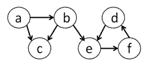
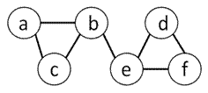
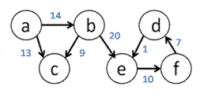
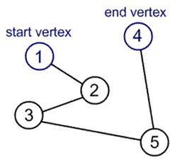

# Problem Set 11


## Fastest Way to Get Around MIT

In this problem set you will write a solution to an optimization problem on how to find the shortest route from one building to another on the MIT campus given you wish to constrain the amount of time you will spend walking outdoors (because generally speaking, the nocturnal beaver… err, the nocturnal MIT engineer… hates the sun).

## Getting Started

Download files:
* ps11.py: code skeleton
* graph.py: a set of graph-related data structures (Digraph, Node, and Edge) that you can use
* mit_map.txt: a sample data file that holds the information about an MIT campus map.

`TODO`

## Background

A graph consists of a set of nodes (n<sub>1</sub>, n<sub>2</sub>, n<sub>3</sub>, ...) and a set of edges (e<sub>1</sub>, e<sub>2</sub>, e<sub>3</sub>, ...) where an edge connects two nodes that are in the graph. The node n1 has children nodes if there exists an edge from n1 to each child node. In Figure 1, Node "a" has children nodes "b" and "c".

There are two types of edges: directed and undirected. If the edge is directed, then the edge has a specific direction going from start to destination node. Graphs with directed edges are called directed graphs (or digraph).



_Figure 1. Example of a directed graph where each edge has a specific direction_

If the edge is undirected, also known as bidirectional, then it no longer matters which node is the start or destination node because you can traverse the edge from one node to the other in either direction. Essentially, a link in the graph can be represented by a directed edge going from Node "d" to Node "e" and a directed edge going in the reverse direction.



_Figure 2. Example of an undirected graph where each edge is bidirectional._

An edge can also have a weight. If every edge is associated with a real number (edge weight), then we have weighted graph.



_Figure 3. Example of an weighted graph where each edge has a weight associated with it._

In a graph theory problem, the __objective__ function is the function to be minimized (or maximized). For example, choosing the shortest path for airplane flights is an optimization problem where the objective function is to minimize the distance traveled. The nodes are the destination airports and edges are the presence of airplane routes between airports. We can add additional __constraints__ on the problem that must be satisfied such as requiring that the plane only make at most 2 stops along the way from start to end destination. Then the shortest path is only valid if it satisfies the constraint.

## Introduction


Here is the map of the MIT campus that we all know and love. From the text input file, `mit_map.txt`, you will build a representation of this map in Python using the graph-related data structures that we provide.
Each line in `mit_map.txt` has 4 pieces of data in it in the following order separated by a single space (space-delimited): the start building, the destination building, the distance in meters between the two buildings, and the distance in meters between the two buildings that must be spent outdoors. For example, suppose the map text file contained the following line:

```
10 32 200 40
```

This means that the map contains an edge from building __10__ (start location) to building __32__ (end location) that is __200__ meters long, where __40__ of those 200 meters are spent outside.

To make the problem interesting, we will say that not every route between a pair of buildings is bi-directional. For example, it may be possible to get from building 54 (Green building) to building 56, but not the other way around, because the wind that blows away from the Green building is too strong.

## Creating the Data Structure Representation

In this problem set, we are dealing with edges that have different weights. In the figure below, the blue numbers show the cost of traversing an edge in terms of total distance traveled, while the green numbers show the cost of traversing an edge in terms of distance spent outdoors. Note that the distance spent outdoors for a single edge is always less than or equal to the total distance it takes to traverse that edge. Now the cost of going from "a" to "b" to "e" is a total distance traveled of 22 meters, where 14 of those meters are spent outdoors. These weights are important when comparing multiple paths because you want to look at the weights associated with the edges in the path instead of just the number of edges traversed.


In `graph.py`, you’ll find the __Digraph__, __Node__, and __Edge__ classes, which do not store information about weights associated with each edge.
Extend the classes so that it fits our case of a weighted graph. Think about how you can modify the classes to store the weights shown above. Make modifications directly in `graph.py`. 

### Hint

Subclass the provided classes to add your own functionality to the new classes. Deciding what representation to use in order to build up the graph is the most challenging part of the problem set, so think through the problem carefully.

## Building up the Campus Map

In the __load_map__ function of `shortest.py` read in the building data from __mapFilename__ and build a directed graph to properly represent the MIT campus map (according to the file).

## Find the Shortest Path using Brute Force

We can define a valid path from a given start to end node in a graph as an ordered sequence of nodes [n<sub>1</sub>, n<sub>2</sub>, ... n<sub>k</sub>], where n<sub>1</sub> to n<sub>k</sub> are existing nodes in the graph and there is an edge from n<sub>i</sub> to n<sub>i+1</sub> for i=1 to k – 1. In Figure 4, each edge is unweighted, so you can assume that each edge is length 1, and then the total distance traveled on the path is 4.



_Figure 4. Example of a path from start to end node._

Note that a graph can contain cycles. A cycle occurs in a graph if the path of nodes leads you back to a node that was already visited in the path. When building up possible paths, if you reach a cycle without knowing it, you could get stuck indefinitely by extending the path with the same nodes that have already been added to the path.


_Figure 5. Example of a cycle in a graph._

In our campus map problem, the __total distance traveled__ on a path is equal to the sum of all total distances traveled between adjacent nodes on this path. Similarly, the __distance spent outdoors__ on the path is equal to the sum of all distances spent outdoors on the edges in the path.

Depending on the number of nodes and edges in a graph, there can be multiple valid paths from one node to another, which may consist of varying distances. We define the __shortest path__ between two nodes to be the path with the __least total distance traveled__. In our campus map problem, one way to find the shortest path from one building to another is to do exhaustive enumeration of all possible paths in the map and then select the shortest one.

How do we find a path in the graph? In the depth-first search algorithm, you try one route at a time while keeping track of routes tried so far. Work off the depth-first traversal algorithm covered in lecture to discover each of the nodes and their children nodes to build up possible paths. Note that you’ll have to adapt the algorithm to fit this problem. Read more about depth-first search [here](https://en.wikipedia.org/wiki/Depth-first_search).

Implement the function `bruteForceSearch(digraph, start, end, maxTotalDist, maxDistOutdoor)` so that for a given digraph, you return the shortest path, from the `start` building to `end` building, such that the total distance traveled is less than or equal to `maxTotalDist` and that the total distance spent outdoors is less than or equal to `maxDistOutdoor`.

Write a comment describing what the optimization problem is in terms of what the function to minimize is and what the constraints are.

Use the __depth-first__ search approach from lecture to enumerate all possible paths from the start to end node on a given digraph. (Assume the start and end nodes are in the graph).

Then select the paths that satisfy the constraint and from that group, pick the shortest path. Return this result as a list of nodes, [n<sub>1</sub>, n<sub>2</sub>, ... n<sub>k</sub>], where there exists an edge from n<sub>1</sub> to n<sub>i+1</sub> in the digraph, for all 1 <= i < k. If multiple paths are still found, then return any one of them. If no path can be found to satisfy these constraints, then raise a ValueError exception.

We strongly suggest the use of helper functions to implement `bruteForceSearch`.

## Optimized Method for Finding the Shortest Path

Since enumerating all the paths is inefficient, let’s optimize our search algorithm for the shortest path. As you discover new children nodes in your depth-first search, you can keep track of the shortest path that so far that minimizes the distance traveled and minimizes the distance outdoors to fit the constraints.

If you come across a path that is longer than your shortest path found so far, then you know that this longer path cannot be your solution, so there is no point in continuing to traverse its children and discover all paths that contain this sub-path.

Implement the function `directedDFS(digraph, start, end, maxTotalDist, maxDistOutdoor)` that uses this optimized method to find the shortest path in a directed graph from start node to end node such that the total distance travelled is less than or equal to `maxtotalDist` and that the total distance spent outdoors is less than or equal to `maxDistOutdoor`. If multiple paths are still found, then return any one of them. If no path can be found to satisfy these constraints, then raise a `ValueError` exception.

We strongly suggest the use of helper functions to implementdirectedDFS.

## Testing

Execute the below to evaluate the correctness of your code using `check50`. But be sure to compile and test it yourself as well!

```
check50 cs21x/checks/path
```

Execute the below to evaluate the style of your code using style50.

```
style50 path.py
```


